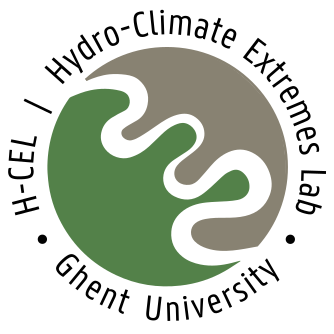

[H-CEL](https://www.ugent.be/bw/environment/en/research/h-cel) is a research lab at Ghent University studying global hydrology, climate, ecology & land-atmosphere interactions using earth observation datacubes, climate and hydrological models.

In this GitHub organisation, we host public code, documentation and teaching material. 
